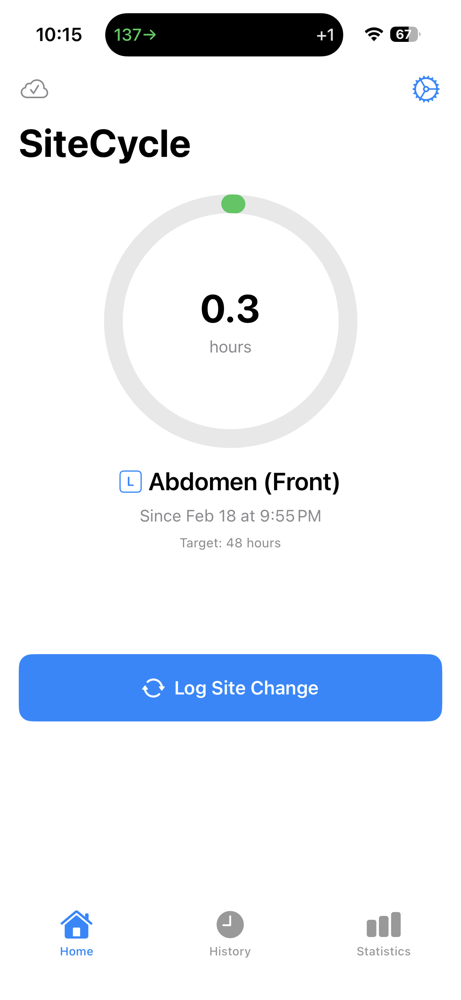
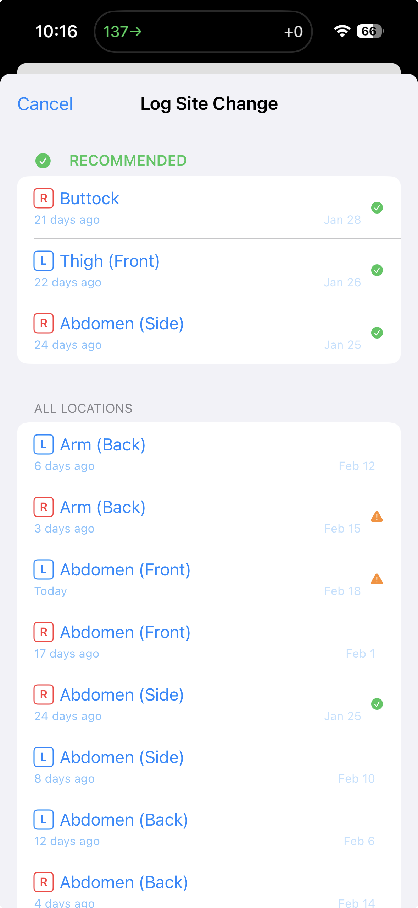
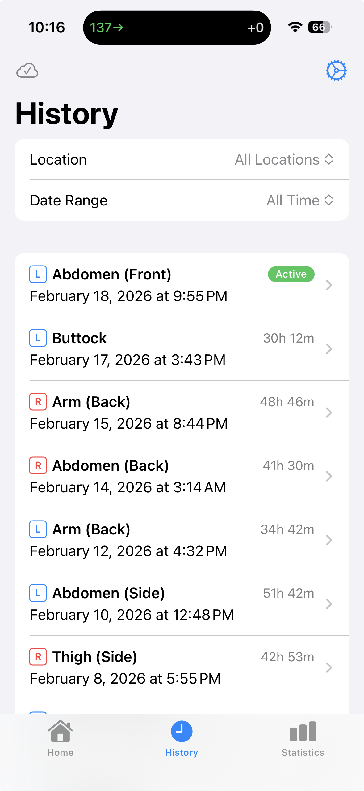
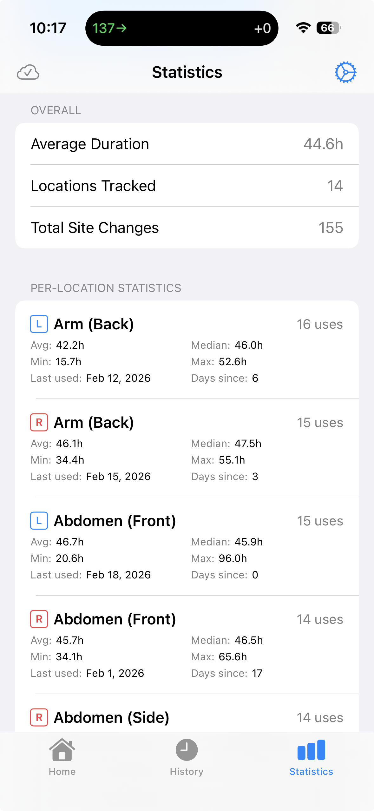
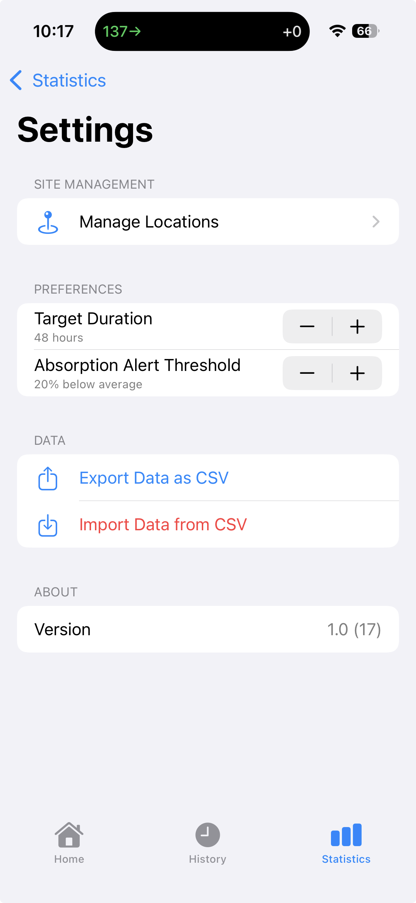
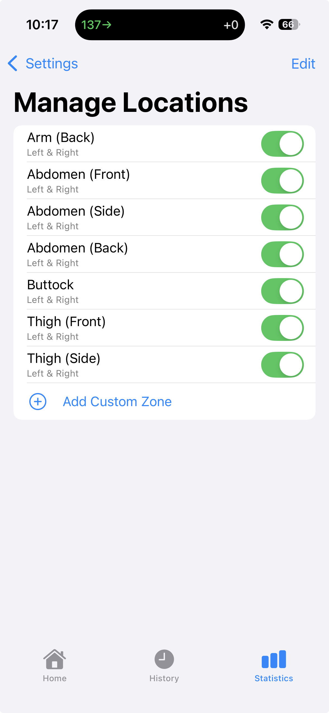

# SiteCycle

Insulin pump users must rotate infusion sites every few days to prevent lipohypertrophy — hardened tissue that impairs insulin absorption. Most people rely on memory alone to track where they last placed their site, which leads to overusing familiar spots and neglecting others. SiteCycle is a focused iOS app that logs each site change, tracks recovery time per location, and recommends where to go next.

## Motivation

I built SiteCycle out of personal need as an insulin pump user. After years of relying on mental notes and occasionally landing on the same few spots, I wanted a simple tool that would take the guesswork out of site rotation. Existing solutions were either buried inside broader diabetes management apps or didn't exist at all. SiteCycle is intentionally focused — it does one thing and aims to do it well.

## Features

- **Smart Site Recommendations** - Suggests the best locations for your next infusion site based on recovery time, and warns you about recently-used sites to avoid
- **Site Change Logging** - Log each site change with a single tap; the app automatically timestamps entries and closes the previous session
- **Location Configuration** - 14 default body locations (7 zones with left/right sides), plus support for custom zones
- **History** - Full chronological log with filtering by location and date range, plus editing and deletion
- **Statistics & Charts** - Per-location usage counts, average/median/min/max durations, absorption insights, and usage distribution charts
- **CSV Export & Import** - Export your complete history as CSV for backup or analysis, and import from CSV
- **iCloud Sync** - Seamless CloudKit sync across devices with no account required
- **Onboarding** - Guided setup to configure your preferred infusion sites

## Screenshots

<table>
  <tr>
    <td align="center"><strong>Home</strong></td>
    <td align="center"><strong>Log Site Change</strong></td>
    <td align="center"><strong>History</strong></td>
  </tr>
  <tr>
    <td></td>
    <td></td>
    <td></td>
  </tr>
  <tr>
    <td align="center"><strong>Statistics</strong></td>
    <td align="center"><strong>Settings</strong></td>
    <td align="center"><strong>Manage Locations</strong></td>
  </tr>
  <tr>
    <td></td>
    <td></td>
    <td></td>
  </tr>
</table>

## How It Works

When you change your infusion site, open SiteCycle and tap "Log Site Change." The app shows your locations sorted into two sections:

1. **Recommended** (green) - The 3 least recently used locations with the most recovery time
2. **All Locations** - Every configured location with inline badges: orange warnings for recently-used sites to avoid, green checkmarks for recommended sites

Select a location, optionally add a note, and confirm. The app handles the rest: timestamping, closing the previous session, and updating recommendations for next time.

## Requirements

- iOS 26.0+
- Xcode 26
- Swift 6.0

> **Note:** This project targets iOS 26, which requires Xcode 26. These version numbers reflect Apple's 2025 platform renumbering — iOS 26 is the successor to iOS 18.

## Tech Stack

- **SwiftUI** for the interface
- **SwiftData** with CloudKit for persistence and sync
- **Swift Charts** for statistics visualizations
- **MVVM architecture** (Models, ViewModels, Views, Utilities)
- **Zero external dependencies** - built entirely with Apple frameworks

## Building

```bash
# Build for iOS Simulator
xcodebuild build \
  -scheme SiteCycle \
  -project SiteCycle.xcodeproj \
  -destination 'platform=iOS Simulator,name=iPhone 16'

# Run tests
xcodebuild test \
  -scheme SiteCycle \
  -project SiteCycle.xcodeproj \
  -destination 'platform=iOS Simulator,name=iPhone 16'
```

## Project Structure

```
SiteCycle/
  Models/
    Location.swift              # Body location model (zone, side, enabled state)
    SiteChangeEntry.swift       # Site change event (start/end time, notes)
  ViewModels/
    HomeViewModel.swift         # Active site status, elapsed time, progress
    SiteChangeViewModel.swift   # Recommendation engine, site logging
    HistoryViewModel.swift      # History queries, filtering, editing
    StatisticsViewModel.swift   # Usage stats, absorption insights
  Views/
    HomeView.swift              # Dashboard with active site and progress ring
    SiteSelectionSheet.swift    # Site picker with avoid/recommended sections
    HistoryView.swift           # Filterable history log
    StatisticsView.swift        # Charts and per-location stats
    LocationConfigView.swift    # Add/edit/reorder body locations
    SettingsView.swift          # Target duration, export, preferences
    OnboardingView.swift        # First-launch setup flow
  Utilities/
    DefaultLocations.swift      # Seeds 14 default locations on first launch
    CSVExporter.swift           # RFC 4180-compliant CSV export
    CSVImporter.swift           # CSV import with validation
SiteCycleTests/                 # Swift Testing suite
```

## CI/CD

GitHub Actions runs SwiftLint and builds/tests on every push and PR to `main`. Automated TestFlight distribution is also configured but requires Apple Developer credentials (distribution certificates and provisioning profiles) set up as repository secrets — see [CI.md](CI.md) for details.

## Roadmap

The following are potential future enhancements:

- Push notifications to remind you when it's time to change your site
- iPad and macOS support
- Apple Watch companion app
- Visual body diagram for site selection
- Integration with CGM data for absorption correlation

## Disclaimer

SiteCycle is a personal tracking tool and is not a medical device. It does not provide medical advice, diagnosis, or treatment recommendations. The site rotation suggestions it provides are based solely on logged usage history and simple timing logic. Always consult your healthcare provider or diabetes care team for guidance on infusion site management.

## License

MIT License — see [LICENSE](./LICENSE) for details.
